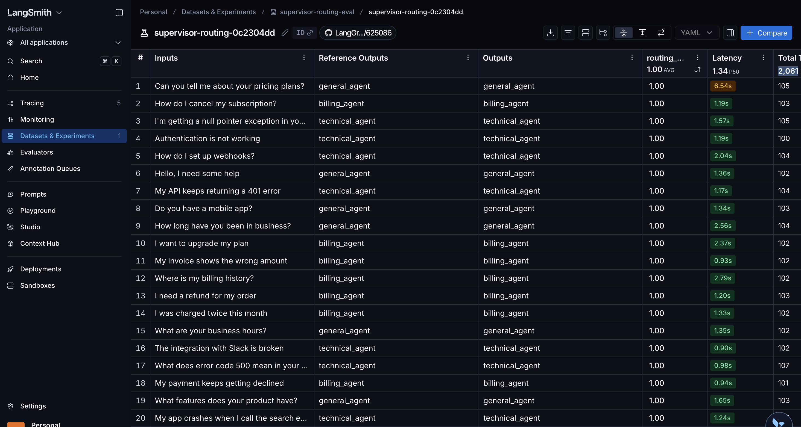
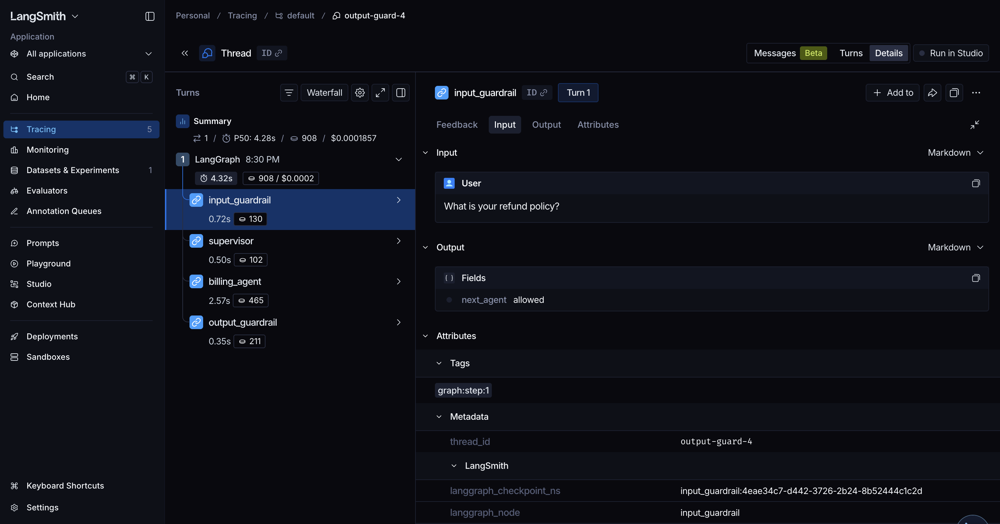
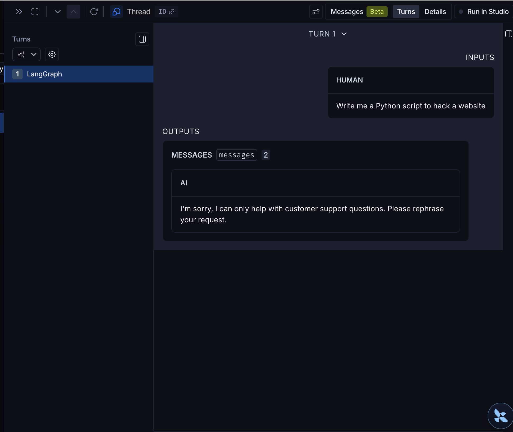
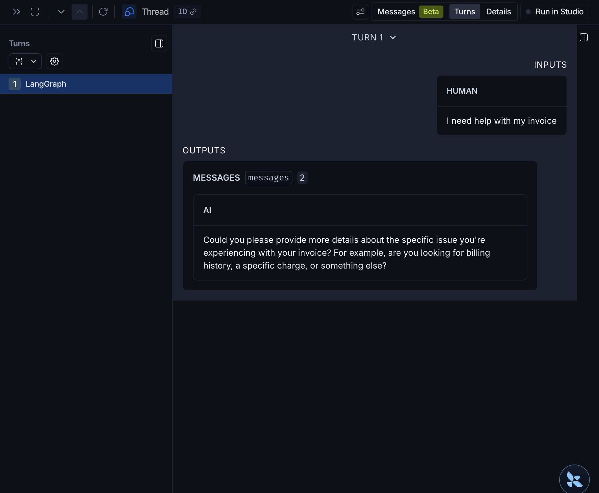

# Multi-Agent Customer Support System

A production-grade multi-agent system built with LangGraph, FastAPI, and MCP. Three specialized agents handle billing, technical, and general customer support requests — with persistence, streaming, human-in-the-loop approval, auto-retry, and an internal knowledge base.

## Architecture

```
User → FastAPI (/chat)
         ↓
    Supervisor Agent        ← routes to the right specialist
    ├── Billing Agent       ← billing questions, refunds, payments
    │     ├── web_search (Tavily)
    │     └── search_knowledge_base (internal policy docs, ChromaDB)
    ├── Technical Agent     ← bugs, APIs, integrations
    │     └── web_search (Tavily)
    └── General Agent       ← greetings, product info, everything else

Postgres ← stores all conversation checkpoints (thread_id namespaced)
```

Each agent has its own MCP server running as a separate container.

## Features

- **Multi-agent routing** — supervisor LLM routes each message to the right specialist
- **Persistent memory** — conversations survive restarts via Postgres checkpointer
- **Streaming responses** — token-by-token streaming via SSE
- **Human-in-the-loop** — billing agent pauses for manager approval before responding
- **Auto-retry** — on agent failure, automatically resumes from last good checkpoint
- **Agentic RAG** — billing agent searches internal policy docs before falling back to web search
- **Per-agent MCP servers** — each agent connects to its own dedicated tool server
- **Evaluation pipeline** — LangSmith eval with 100% baseline routing accuracy

## Stack

- [LangGraph](https://github.com/langchain-ai/langgraph) — agent orchestration and state management
- [FastAPI](https://fastapi.tiangolo.com/) — HTTP API with streaming responses
- [MCP (Model Context Protocol)](https://modelcontextprotocol.io/) — tool server protocol
- [PostgreSQL](https://www.postgresql.org/) — conversation persistence via LangGraph checkpointer
- [ChromaDB](https://www.trychroma.com/) — vector store for internal knowledge base
- [LangSmith](https://smith.langchain.com/) — tracing and evaluation
- [Tavily](https://tavily.com/) — web search API
- [OpenAI gpt-4o-mini](https://openai.com/) — all agents

## Project Structure

```
final_project/
├── api/
│   └── main.py              # FastAPI app, lifespan, /chat, /history, /approve
├── agents/
│   ├── supervisor.py        # routes to billing/technical/general
│   ├── billing.py           # handles refunds, payments, billing questions
│   ├── technical.py         # handles bugs, APIs, integrations
│   └── general.py           # handles everything else
├── mcp_server/
│   ├── billing_server.py    # MCP server on port 8081 (web_search + search_knowledge_base)
│   ├── technical_server.py  # MCP server on port 8082 (web_search)
│   └── Dockerfile
├── rag/
│   └── knowledge_base.py    # ChromaDB vector store, company policy documents
├── evals/
│   └── supervisor_eval.py   # LangSmith routing accuracy eval (100% baseline)
├── graph.py                 # StateGraph definition, node wiring
├── state.py                 # TypedDict state schema
├── docker-compose.yml       # 4 services: postgres, billing-mcp, technical-mcp, fastapi
├── Dockerfile               # FastAPI container
└── requirements.txt
```

## Running Locally

**Prerequisites:** Docker Desktop, OpenAI API key, Tavily API key, LangSmith API key

1. Clone the repo and create `.env` in the root:
```
OPENAI_API_KEY=...
TAVILY_API_KEY=...
LANGCHAIN_API_KEY=...
LANGCHAIN_TRACING_V2=true
LANGCHAIN_ENDPOINT=https://api.smith.langchain.com
```

2. Start all services:
```bash
cd final_project
docker compose up --build
```

3. Send a message:
```bash
curl -X POST http://localhost:8000/chat \
  -H "Content-Type: application/json" \
  -d '{"message": "What is your refund policy?", "thread_id": "thread-1"}'
```

## API Endpoints

| Method | Endpoint | Description |
|--------|----------|-------------|
| POST | `/chat` | Send a message, streams response via SSE |
| GET | `/history/{thread_id}` | Get full conversation history |
| POST | `/approve/{thread_id}` | Resume a paused billing agent (human-in-the-loop) |

## Running Evals

**Supervisor routing accuracy:**
```bash
python -m final_project.evals.supervisor_eval
```
Creates a dataset in LangSmith and runs routing accuracy eval. Baseline: 100% (20/20).



**Billing agent quality (LLM-as-judge):**
```bash
python -m final_project.evals.billing_eval
```
Runs 5 policy-specific test cases against the billing agent with RAG wired in. LLM judge scores each response 0/0.5/1.0 based on whether it satisfies exact policy criteria (refund windows, dispute deadlines, payment methods). Baseline: 80–100%.

## LangSmith Full Trace

Every node visible with execution time and token count — full observability of the agent pipeline.



## Guardrails

Input guardrail blocks harmful or off-topic messages before they reach any agent.

**Blocked request:**


**Allowed request:**


## Future Improvements

- **CI/CD eval pipeline** — GitHub Actions runs `supervisor_eval.py` on every push to `final_project/agents/**`. Blocks merges if routing accuracy drops below baseline.
- **General agent RAG** — product FAQ knowledge base for the general agent
- **Simple frontend** — HTML page calling `/chat` with streaming display
- **Eval for technical agent** — LLM-as-judge eval for technical agent response quality

## Human-in-the-Loop

Billing agent pauses after running. Resume with:
```bash
curl -X POST http://localhost:8000/approve/{thread_id}
```

In production this would be wired to an internal dashboard or Slack bot.
